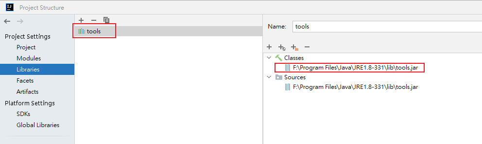
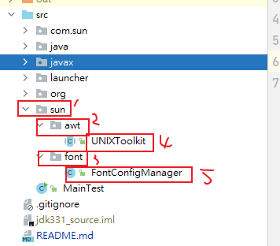

# rabbit-jdk1.8_331source

JDK1.8_331源码环境搭建

本地搭建源码调试环境，除了需要jdk下的src.zip源码之外
<br>
1.添加tools.jar包到Library中


2.还需要如下建包



两个类的代码
UNIXToolkit
```java
package sun.awt;

import com.sun.java.swing.plaf.gtk.GTKConstants.TextDirection;
import sun.java2d.opengl.OGLRenderQueue;
import sun.security.action.GetIntegerAction;
import sun.security.action.GetPropertyAction;

import java.awt.*;
import java.awt.color.ColorSpace;
import java.awt.image.*;
import java.security.AccessController;
import java.security.PrivilegedAction;

import static java.awt.RenderingHints.*;

public abstract class UNIXToolkit extends SunToolkit
{
    /** All calls into GTK should be synchronized on this lock */
    public static final Object GTK_LOCK = new Object();

    private static final int[] BAND_OFFSETS = { 0, 1, 2 };
    private static final int[] BAND_OFFSETS_ALPHA = { 0, 1, 2, 3 };
    private static final int DEFAULT_DATATRANSFER_TIMEOUT = 10000;

    // Allowed GTK versions
    public enum GtkVersions {
        ANY(0),
        GTK2(Constants.GTK2_MAJOR_NUMBER),
        GTK3(Constants.GTK3_MAJOR_NUMBER);

        static class Constants {
            static final int GTK2_MAJOR_NUMBER = 2;
            static final int GTK3_MAJOR_NUMBER = 3;
        }

        final int number;

        GtkVersions(int number) {
            this.number = number;
        }

        public static GtkVersions getVersion(int number) {
            switch (number) {
                case Constants.GTK2_MAJOR_NUMBER:
                    return GTK2;
                case Constants.GTK3_MAJOR_NUMBER:
                    return GTK3;
                default:
                    return ANY;
            }
        }

        // major GTK version number
        public int getNumber() {
            return number;
        }
    };

    private Boolean nativeGTKAvailable;
    private Boolean nativeGTKLoaded;
    private BufferedImage tmpImage = null;

    public static int getDatatransferTimeout() {
        Integer dt = (Integer)AccessController.doPrivileged(
                new GetIntegerAction("sun.awt.datatransfer.timeout"));
        if (dt == null || dt <= 0) {
            return DEFAULT_DATATRANSFER_TIMEOUT;
        } else {
            return dt;
        }
    }

    /**
     * Returns true if the native GTK libraries are capable of being
     * loaded and are expected to work properly, false otherwise.  Note
     * that this method will not leave the native GTK libraries loaded if
     * they haven't already been loaded.  This allows, for example, Swing's
     * GTK L&F to test for the presence of native GTK support without
     * leaving the native libraries loaded.  To attempt long-term loading
     * of the native GTK libraries, use the loadGTK() method instead.
     */
    @Override
    public boolean isNativeGTKAvailable() {
        synchronized (GTK_LOCK) {
            if (nativeGTKLoaded != null) {
                // We've already attempted to load GTK, so just return the
                // status of that attempt.
                return nativeGTKLoaded;

            } else if (nativeGTKAvailable != null) {
                // We've already checked the availability of the native GTK
                // libraries, so just return the status of that attempt.
                return nativeGTKAvailable;

            } else {
                boolean success = check_gtk(getEnabledGtkVersion().getNumber());
                nativeGTKAvailable = success;
                return success;
            }
        }
    }

    /**
     * Loads the GTK libraries, if necessary.  The first time this method
     * is called, it will attempt to load the native GTK library.  If
     * successful, it leaves the library open and returns true; otherwise,
     * the library is left closed and returns false.  On future calls to
     * this method, the status of the first attempt is returned (a simple
     * lightweight boolean check, no native calls required).
     */
    public boolean loadGTK() {
        synchronized (GTK_LOCK) {
            if (nativeGTKLoaded == null) {
                nativeGTKLoaded = load_gtk(getEnabledGtkVersion().getNumber(),
                        isGtkVerbose());
            }
        }
        return nativeGTKLoaded;
    }

    /**
     * Overridden to handle GTK icon loading
     */
    protected Object lazilyLoadDesktopProperty(String name) {
        if (name.startsWith("gtk.icon.")) {
            return lazilyLoadGTKIcon(name);
        }
        return super.lazilyLoadDesktopProperty(name);
    }

    /**
     * Load a native Gtk stock icon.
     *
     * @param longname a desktop property name. This contains icon name, size
     *        and orientation, e.g. <code>"gtk.icon.gtk-add.4.rtl"</code>
     * @return an <code>Image</code> for the icon, or <code>null</code> if the
     *         icon could not be loaded
     */
    protected Object lazilyLoadGTKIcon(String longname) {
        // Check if we have already loaded it.
        Object result = desktopProperties.get(longname);
        if (result != null) {
            return result;
        }

        // We need to have at least gtk.icon.<stock_id>.<size>.<orientation>
        String str[] = longname.split("\\.");
        if (str.length != 5) {
            return null;
        }

        // Parse out the stock icon size we are looking for.
        int size = 0;
        try {
            size = Integer.parseInt(str[3]);
        } catch (NumberFormatException nfe) {
            return null;
        }

        // Direction.
        TextDirection dir = ("ltr".equals(str[4]) ? TextDirection.LTR :
                TextDirection.RTL);

        // Load the stock icon.
        BufferedImage img = getStockIcon(-1, str[2], size, dir.ordinal(), null);
        if (img != null) {
            // Create the desktop property for the icon.
            setDesktopProperty(longname, img);
        }
        return img;
    }

    /**
     * Returns a BufferedImage which contains the Gtk icon requested.  If no
     * such icon exists or an error occurs loading the icon the result will
     * be null.
     *
     * @param filename
     * @return The icon or null if it was not found or loaded.
     */
    public BufferedImage getGTKIcon(final String filename) {
        if (!loadGTK()) {
            return null;

        } else {
            // Call the native method to load the icon.
            synchronized (GTK_LOCK) {
                if (!load_gtk_icon(filename)) {
                    tmpImage = null;
                }
            }
        }
        // Return local image the callback loaded the icon into.
        return tmpImage;
    }

    /**
     * Returns a BufferedImage which contains the Gtk stock icon requested.
     * If no such stock icon exists the result will be null.
     *
     * @param widgetType one of WidgetType values defined in GTKNativeEngine or
     * -1 for system default stock icon.
     * @param stockId String which defines the stock id of the gtk item.
     * For a complete list reference the API at www.gtk.org for StockItems.
     * @param iconSize One of the GtkIconSize values defined in GTKConstants
     * @param textDirection One of the TextDirection values defined in
     * GTKConstants
     * @param detail Render detail that is passed to the native engine (feel
     * free to pass null)
     * @return The stock icon or null if it was not found or loaded.
     */
    public BufferedImage getStockIcon(final int widgetType, final String stockId,
                                      final int iconSize, final int direction,
                                      final String detail) {
        if (!loadGTK()) {
            return null;

        } else {
            // Call the native method to load the icon.
            synchronized (GTK_LOCK) {
                if (!load_stock_icon(widgetType, stockId, iconSize, direction, detail)) {
                    tmpImage = null;
                }
            }
        }
        // Return local image the callback loaded the icon into.
        return tmpImage;  // set by loadIconCallback
    }

    /**
     * This method is used by JNI as a callback from load_stock_icon.
     * Image data is passed back to us via this method and loaded into the
     * local BufferedImage and then returned via getStockIcon.
     *
     * Do NOT call this method directly.
     */
    public void loadIconCallback(byte[] data, int width, int height,
                                 int rowStride, int bps, int channels, boolean alpha) {
        // Reset the stock image to null.
        tmpImage = null;

        // Create a new BufferedImage based on the data returned from the
        // JNI call.
        DataBuffer dataBuf = new DataBufferByte(data, (rowStride * height));
        // Maybe test # channels to determine band offsets?
        WritableRaster raster = Raster.createInterleavedRaster(dataBuf,
                width, height, rowStride, channels,
                (alpha ? BAND_OFFSETS_ALPHA : BAND_OFFSETS), null);
        ColorModel colorModel = new ComponentColorModel(
                ColorSpace.getInstance(ColorSpace.CS_sRGB), alpha, false,
                ColorModel.TRANSLUCENT, DataBuffer.TYPE_BYTE);

        // Set the local image so we can return it later from
        // getStockIcon().
        tmpImage = new BufferedImage(colorModel, raster, false, null);
    }

    private static native boolean check_gtk(int version);
    private static native boolean load_gtk(int version, boolean verbose);
    private static native boolean unload_gtk();
    private native boolean load_gtk_icon(String filename);
    private native boolean load_stock_icon(int widget_type, String stock_id,
                                           int iconSize, int textDirection, String detail);

    private native void nativeSync();
    private static native int get_gtk_version();

    @Override
    public void sync() {
        // flush the X11 buffer
        nativeSync();
        // now flush the OGL pipeline (this is a no-op if OGL is not enabled)
        OGLRenderQueue.sync();
    }

    /*
     * This returns the value for the desktop property "awt.font.desktophints"
     * It builds this by querying the Gnome desktop properties to return
     * them as platform independent hints.
     * This requires that the Gnome properties have already been gathered.
     */
    public static final String FONTCONFIGAAHINT = "fontconfig/Antialias";

    @Override
    protected RenderingHints getDesktopAAHints() {

        Object aaValue = getDesktopProperty("gnome.Xft/Antialias");

        if (aaValue == null) {
            /* On a KDE desktop running KWin the rendering hint will
             * have been set as property "fontconfig/Antialias".
             * No need to parse further in this case.
             */
            aaValue = getDesktopProperty(FONTCONFIGAAHINT);
            if (aaValue != null) {
                return new RenderingHints(KEY_TEXT_ANTIALIASING, aaValue);
            } else {
                return null; // no Gnome or KDE Desktop properties available.
            }
        }

        /* 0 means off, 1 means some ON. What would any other value mean?
         * If we require "1" to enable AA then some new value would cause
         * us to default to "OFF". I don't think that's the best guess.
         * So if its !=0 then lets assume AA.
         */
        boolean aa = ((aaValue instanceof Number)
                && ((Number) aaValue).intValue() != 0);
        Object aaHint;
        if (aa) {
            String subpixOrder =
                    (String)getDesktopProperty("gnome.Xft/RGBA");

            if (subpixOrder == null || subpixOrder.equals("none")) {
                aaHint = VALUE_TEXT_ANTIALIAS_ON;
            } else if (subpixOrder.equals("rgb")) {
                aaHint = VALUE_TEXT_ANTIALIAS_LCD_HRGB;
            } else if (subpixOrder.equals("bgr")) {
                aaHint = VALUE_TEXT_ANTIALIAS_LCD_HBGR;
            } else if (subpixOrder.equals("vrgb")) {
                aaHint = VALUE_TEXT_ANTIALIAS_LCD_VRGB;
            } else if (subpixOrder.equals("vbgr")) {
                aaHint = VALUE_TEXT_ANTIALIAS_LCD_VBGR;
            } else {
                /* didn't recognise the string, but AA is requested */
                aaHint = VALUE_TEXT_ANTIALIAS_ON;
            }
        } else {
            aaHint = VALUE_TEXT_ANTIALIAS_DEFAULT;
        }
        return new RenderingHints(KEY_TEXT_ANTIALIASING, aaHint);
    }

    private native boolean gtkCheckVersionImpl(int major, int minor,
                                               int micro);

    /**
     * Returns {@code true} if the GTK+ library is compatible with the given
     * version.
     *
     * @param major
     *            The required major version.
     * @param minor
     *            The required minor version.
     * @param micro
     *            The required micro version.
     * @return {@code true} if the GTK+ library is compatible with the given
     *         version.
     */
    public boolean checkGtkVersion(int major, int minor, int micro) {
        if (loadGTK()) {
            return gtkCheckVersionImpl(major, minor, micro);
        }
        return false;
    }

    public static GtkVersions getEnabledGtkVersion() {
        String version = AccessController.doPrivileged(
                new GetPropertyAction("jdk.gtk.version"));
        if (version == null) {
            return GtkVersions.ANY;
        } else if (version.startsWith("2")) {
            return GtkVersions.GTK2;
        } else if("3".equals(version) ){
            return GtkVersions.GTK3;
        }
        return GtkVersions.ANY;
    }

    public static GtkVersions getGtkVersion() {
        return GtkVersions.getVersion(get_gtk_version());
    }

    public static boolean isGtkVerbose() {
        return AccessController.doPrivileged((PrivilegedAction<Boolean>)()
                -> Boolean.getBoolean("jdk.gtk.verbose"));
    }
}
```

<br>

FontConfigManager.java

```java
package sun.font;

import sun.awt.SunHints;
import sun.awt.SunToolkit;
import sun.util.logging.PlatformLogger;

import java.util.Locale;

/**
* Small utility class to manage FontConfig.
  */
  public class FontConfigManager {

  static boolean fontConfigFailed = false;

  /* This is populated by native */
  private static final FontConfigInfo fcInfo = new FontConfigInfo();

  /* Begin support for GTK Look and Feel - query libfontconfig and
    * return a composite Font to Swing that uses the desktop font(s).
      */

  /* These next three classes are just data structures.
  */
  public static class FontConfigFont {
  public String familyName;        // eg Bitstream Vera Sans
  public String styleStr;          // eg Bold
  public String fullName;          // eg Bitstream Vera Sans Bold
  public String fontFile;          // eg /usr/X11/lib/fonts/foo.ttf
  }

  public static class FcCompFont {
  public String fcName;            // eg sans
  public String fcFamily;          // eg sans
  public String jdkName;           // eg sansserif
  public int style;                // eg 0=PLAIN
  public FontConfigFont firstFont;
  public FontConfigFont[] allFonts;
  //boolean preferBitmaps;    // if embedded bitmaps preferred over AA
  public CompositeFont compFont;   // null if not yet created/known.
  }

  public static class FontConfigInfo {
  public int fcVersion;
  public String[] cacheDirs = new String[4];
  }

  /* fontconfig recognises slants roman, italic, as well as oblique,
    * and a slew of weights, where the ones that matter here are
    * regular and bold.
    * To fully qualify what we want, we can for example ask for (eg)
    * Font.PLAIN             : "serif:regular:roman"
    * Font.BOLD              : "serif:bold:roman"
    * Font.ITALIC            : "serif:regular:italic"
    * Font.BOLD|Font.ITALIC  : "serif:bold:italic"
      */
      private static String[] fontConfigNames = {
      "sans:regular:roman",
      "sans:bold:roman",
      "sans:regular:italic",
      "sans:bold:italic",

           "serif:regular:roman",
           "serif:bold:roman",
           "serif:regular:italic",
           "serif:bold:italic",

           "monospace:regular:roman",
           "monospace:bold:roman",
           "monospace:regular:italic",
           "monospace:bold:italic",
  };

  /* This array has the array elements created in Java code and is
    * passed down to native to be filled in.
      */
      private FcCompFont[] fontConfigFonts;

  /**
    * Instantiates a new FontConfigManager getting the default instance
    * of FontManager from the FontManagerFactory.
      */
      public FontConfigManager() {
      }

  /* Called from code that needs to know what are the AA settings
    * that apps using FC would pick up for the default desktop font.
    * Note apps can change the default desktop font. etc, so this
    * isn't certain to be right but its going to correct for most cases.
    * Native return values map to the text aa values in sun.awt.SunHints.
    * which is used to look up the renderinghint value object.
      */
      public static Object getFontConfigAAHint() {
      return getFontConfigAAHint("sans");
      }

  /* This is public solely so that for debugging purposes it can be called
    * with other names, which might (eg) include a size, eg "sans-24"
    * The return value is a text aa rendering hint value.
    * Normally we should call the no-args version.
      */
      public static Object getFontConfigAAHint(String fcFamily) {
      if (FontUtilities.isWindows) {
      return null;
      } else {
      int hint = getFontConfigAASettings(getFCLocaleStr(), fcFamily);
      if (hint < 0) {
      return null;
      } else {
      return SunHints.Value.get(SunHints.INTKEY_TEXT_ANTIALIASING,
      hint);
      }
      }
      }


    private static String getFCLocaleStr() {
        Locale l = SunToolkit.getStartupLocale();
        String localeStr = l.getLanguage();
        String country = l.getCountry();
        if (!country.equals("")) {
            localeStr = localeStr + "-" + country;
        }
        return localeStr;
    }

    /* This does cause the native libfontconfig to be loaded and unloaded,
     * but it does not incur the overhead of initialisation of its
     * data structures, so shouldn't have a measurable impact.
     */
    public static native int getFontConfigVersion();

    /* This can be made public if it's needed to force a re-read
     * rather than using the cached values. The re-read would be needed
     * only if some event signalled that the fontconfig has changed.
     * In that event this method would need to return directly the array
     * to be used by the caller in case it subsequently changed.
     */
    public synchronized void initFontConfigFonts(boolean includeFallbacks) {

        if (fontConfigFonts != null) {
            if (!includeFallbacks || (fontConfigFonts[0].allFonts != null)) {
                return;
            }
        }

        if (FontUtilities.isWindows || fontConfigFailed) {
            return;
        }

        long t0 = 0;
        if (FontUtilities.isLogging()) {
            t0 = System.nanoTime();
        }

        FcCompFont[] fontArr = new FcCompFont[fontConfigNames.length];

        for (int i = 0; i< fontArr.length; i++) {
            fontArr[i] = new FcCompFont();
            fontArr[i].fcName = fontConfigNames[i];
            int colonPos = fontArr[i].fcName.indexOf(':');
            fontArr[i].fcFamily = fontArr[i].fcName.substring(0, colonPos);
            fontArr[i].jdkName = FontUtilities.mapFcName(fontArr[i].fcFamily);
            fontArr[i].style = i % 4; // depends on array order.
        }
        getFontConfig(getFCLocaleStr(), fcInfo, fontArr, includeFallbacks);
        FontConfigFont anyFont = null;
        /* If don't find anything (eg no libfontconfig), then just return */
        for (int i = 0; i< fontArr.length; i++) {
            FcCompFont fci = fontArr[i];
            if (fci.firstFont == null) {
                if (FontUtilities.isLogging()) {
                    PlatformLogger logger = FontUtilities.getLogger();
                    logger.info("Fontconfig returned no font for " +
                            fontArr[i].fcName);
                }
                fontConfigFailed = true;
            } else if (anyFont == null) {
                anyFont = fci.firstFont;
            }
        }

        if (anyFont == null) {
            if (FontUtilities.isLogging()) {
                PlatformLogger logger = FontUtilities.getLogger();
                logger.info("Fontconfig returned no fonts at all.");
            }
            fontConfigFailed = true;
            return;
        } else if (fontConfigFailed) {
            for (int i = 0; i< fontArr.length; i++) {
                if (fontArr[i].firstFont == null) {
                    fontArr[i].firstFont = anyFont;
                }
            }
        }

        fontConfigFonts = fontArr;

        if (FontUtilities.isLogging()) {

            PlatformLogger logger = FontUtilities.getLogger();

            long t1 = System.nanoTime();
            logger.info("Time spent accessing fontconfig="
                    + ((t1 - t0) / 1000000) + "ms.");

            for (int i = 0; i< fontConfigFonts.length; i++) {
                FcCompFont fci = fontConfigFonts[i];
                logger.info("FC font " + fci.fcName+" maps to family " +
                        fci.firstFont.familyName +
                        " in file " + fci.firstFont.fontFile);
                if (fci.allFonts != null) {
                    for (int f=0;f<fci.allFonts.length;f++) {
                        FontConfigFont fcf = fci.allFonts[f];
                        logger.info("Family=" + fcf.familyName +
                                " Style="+ fcf.styleStr +
                                " Fullname="+fcf.fullName +
                                " File="+fcf.fontFile);
                    }
                }
            }
        }
    }

    public PhysicalFont registerFromFcInfo(FcCompFont fcInfo) {

        SunFontManager fm = SunFontManager.getInstance();

        /* If it's a TTC file we need to know that as we will need to
         * make sure we return the right font */
        String fontFile = fcInfo.firstFont.fontFile;
        int offset = fontFile.length()-4;
        if (offset <= 0) {
            return null;
        }
        String ext = fontFile.substring(offset).toLowerCase();
        boolean isTTC = ext.equals(".ttc");

        /* If this file is already registered, can just return its font.
         * However we do need to check in case it's a TTC as we need
         * a specific font, so rather than directly returning it, let
         * findFont2D resolve that.
         */
        PhysicalFont physFont = fm.getRegisteredFontFile(fontFile);
        if (physFont != null) {
            if (isTTC) {
                Font2D f2d = fm.findFont2D(fcInfo.firstFont.familyName,
                        fcInfo.style,
                        FontManager.NO_FALLBACK);
                if (f2d instanceof PhysicalFont) { /* paranoia */
                    return (PhysicalFont)f2d;
                } else {
                    return null;
                }
            } else {
                return physFont;
            }
        }

        /* If the font may hide a JRE font (eg fontconfig says it is
         * Lucida Sans), we want to use the JRE version, so make it
         * point to the JRE font.
         */
        physFont = fm.findJREDeferredFont(fcInfo.firstFont.familyName,
                fcInfo.style);

        /* It is also possible the font file is on the "deferred" list,
         * in which case we can just initialise it now.
         */
        if (physFont == null &&
                fm.isDeferredFont(fontFile) == true) {
            physFont = fm.initialiseDeferredFont(fcInfo.firstFont.fontFile);
            /* use findFont2D to get the right font from TTC's */
            if (physFont != null) {
                if (isTTC) {
                    Font2D f2d = fm.findFont2D(fcInfo.firstFont.familyName,
                            fcInfo.style,
                            FontManager.NO_FALLBACK);
                    if (f2d instanceof PhysicalFont) { /* paranoia */
                        return (PhysicalFont)f2d;
                    } else {
                        return null;
                    }
                } else {
                    return physFont;
                }
            }
        }

        /* In the majority of cases we reach here, and need to determine
         * the type and rank to register the font.
         */
        if (physFont == null) {
            int fontFormat = SunFontManager.FONTFORMAT_NONE;
            int fontRank = Font2D.UNKNOWN_RANK;

            if (ext.equals(".ttf") || isTTC) {
                fontFormat = SunFontManager.FONTFORMAT_TRUETYPE;
                fontRank = Font2D.TTF_RANK;
            } else if (ext.equals(".pfa") || ext.equals(".pfb")) {
                fontFormat = SunFontManager.FONTFORMAT_TYPE1;
                fontRank = Font2D.TYPE1_RANK;
            }
            physFont = fm.registerFontFile(fcInfo.firstFont.fontFile, null,
                    fontFormat, true, fontRank);
        }
        return physFont;
    }

    /*
     * We need to return a Composite font which has as the font in
     * its first slot one obtained from fontconfig.
     */
    public CompositeFont getFontConfigFont(String name, int style) {

        name = name.toLowerCase();

        initFontConfigFonts(false);
        if (fontConfigFonts == null) {
            // This avoids an immediate NPE if fontconfig look up failed
            // but doesn't guarantee this is a recoverable situation.
            return null;
        }

        FcCompFont fcInfo = null;
        for (int i=0; i<fontConfigFonts.length; i++) {
            if (name.equals(fontConfigFonts[i].fcFamily) &&
                    style == fontConfigFonts[i].style) {
                fcInfo = fontConfigFonts[i];
                break;
            }
        }
        if (fcInfo == null) {
            fcInfo = fontConfigFonts[0];
        }

        if (FontUtilities.isLogging()) {
            FontUtilities.getLogger()
                    .info("FC name=" + name + " style=" + style +
                            " uses " + fcInfo.firstFont.familyName +
                            " in file: " + fcInfo.firstFont.fontFile);
        }

        if (fcInfo.compFont != null) {
            return fcInfo.compFont;
        }

        /* jdkFont is going to be used for slots 1..N and as a fallback.
         * Slot 0 will be the physical font from fontconfig.
         */
        FontManager fm = FontManagerFactory.getInstance();
        CompositeFont jdkFont = (CompositeFont)
                fm.findFont2D(fcInfo.jdkName, style, FontManager.LOGICAL_FALLBACK);

        if (fcInfo.firstFont.familyName == null ||
                fcInfo.firstFont.fontFile == null) {
            return (fcInfo.compFont = jdkFont);
        }

        /* First, see if the family and exact style is already registered.
         * If it is, use it. If it's not, then try to register it.
         * If that registration fails (signalled by null) just return the
         * regular JDK composite.
         * Algorithmically styled fonts won't match on exact style, so
         * will fall through this code, but the regisration code will
         * find that file already registered and return its font.
         */
        FontFamily family = FontFamily.getFamily(fcInfo.firstFont.familyName);
        PhysicalFont physFont = null;
        if (family != null) {
            Font2D f2D = family.getFontWithExactStyleMatch(fcInfo.style);
            if (f2D instanceof PhysicalFont) {
                physFont = (PhysicalFont)f2D;
            }
        }

        if (physFont == null ||
                !fcInfo.firstFont.fontFile.equals(physFont.platName)) {
            physFont = registerFromFcInfo(fcInfo);
            if (physFont == null) {
                return (fcInfo.compFont = jdkFont);
            }
            family = FontFamily.getFamily(physFont.getFamilyName(null));
        }

        /* Now register the fonts in the family (the other styles) after
         * checking that they aren't already registered and are actually in
         * a different file. They may be the same file in CJK cases.
         * For cases where they are different font files - eg as is common for
         * Latin fonts, then we rely on fontconfig to report these correctly.
         * Assume that all styles of this font are found by fontconfig,
         * so we can find all the family members which must be registered
         * together to prevent synthetic styling.
         */
        for (int i=0; i<fontConfigFonts.length; i++) {
            FcCompFont fc = fontConfigFonts[i];
            if (fc != fcInfo &&
                    physFont.getFamilyName(null).equals(fc.firstFont.familyName) &&
                    !fc.firstFont.fontFile.equals(physFont.platName) &&
                    family.getFontWithExactStyleMatch(fc.style) == null) {

                registerFromFcInfo(fontConfigFonts[i]);
            }
        }

        /* Now we have a physical font. We will back this up with the JDK
         * logical font (sansserif, serif, or monospaced) that corresponds
         * to the Pango/GTK/FC logical font name.
         */
        return (fcInfo.compFont = new CompositeFont(physFont, jdkFont));
    }

    /**
     *
     * @param locale
     * @param fcFamily
     * @return
     */
    public FcCompFont[] getFontConfigFonts() {
        return fontConfigFonts;
    }

    /* Return an array of FcCompFont structs describing the primary
     * font located for each of fontconfig/GTK/Pango's logical font names.
     */
    private static native void getFontConfig(String locale,
                                             FontConfigInfo fcInfo,
                                             FcCompFont[] fonts,
                                             boolean includeFallbacks);

    void populateFontConfig(FcCompFont[] fcInfo) {
        fontConfigFonts = fcInfo;
    }

    FcCompFont[] loadFontConfig() {
        initFontConfigFonts(true);
        return fontConfigFonts;
    }

    FontConfigInfo getFontConfigInfo() {
        initFontConfigFonts(true);
        return fcInfo;
    }

    private static native int
    getFontConfigAASettings(String locale, String fcFamily);
}
```